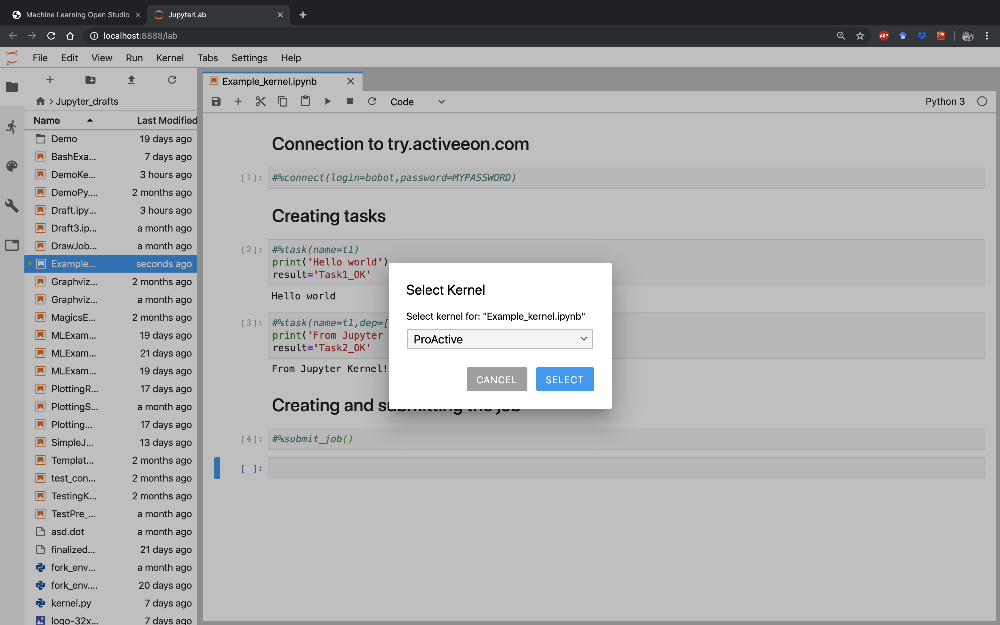
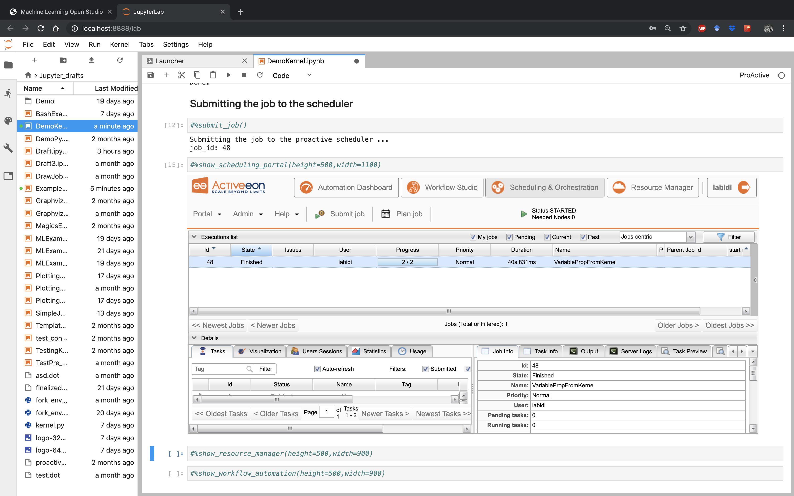

# proactive-jupyter-kernel
The ActiveEon Jupyter Kernel adds a kernel backend to Jupyter. This kernel interfaces directly with the ProActive
scheduler and constructs tasks and workflows to execute them on the fly.

With this interface, users can run their code locally and test it using a native python kernel, and by a simple switch to
ProActive kernel, run it on remote public or private infrastructures without having to modify the code. See the example below:



## 1. Installation:

### 1.1 Requirements:

Python 2 or 3

### 1.2 Using PyPi

* open a terminal

* install the ProActive jupyter kernel with the following commands:

```bash
$ pip install proactive proactive-jupyter-kernel --upgrade
$ python -m proactive-jupyter-kernel.install
```

### 1.3 Using source code

* open a terminal

* clone the repository on your local machine:

```bash
$ git clone git@github.com:ow2-proactive/proactive-jupyter-kernel.git
```

* install the ProActive jupyter kernel with the following commands:

```bash
$ pip install proactive-jupyter-kernel/
$ python -m proactive-jupyter-kernel.install
```

## 2. Platform

You can use any jupyter platform.
We recommend to use [jupyter lab](https://jupyterlab.readthedocs.io/en/stable/). To launch it from your terminal after
having installed it:

```bash
$ jupyter lab
```
or in daemon mode:
```bash
$ nohup jupyter lab &>/dev/null &
```

When opened, click on the ProActive icon to open a notebook based on the ProActive kernel.

## 3. Help

As a quick start, we recommend the user to run the `#%help()` pragma using the following script:

```python
#%help()
```

This script gives a brief description of all the different pragmas that the ProActive Kernel provides.

To get a more detailed description of a needed pragma, the user can run the following script:

```python
#%help(pragma=PRAGMA_NAME)
```

## 4. Connection

### 4.1 Using connect()

If you are trying ProActive for the first time, sign up on the [try platform](https://try.activeeon.com/signup.html).
Once you receive your login and password, connect to the trial platform using the `#%connect()` pragma:

```python
#%connect(login=YOUR_LOGIN, password=YOUR_PASSWORD)
```

To connect to another ProActive server host, use the later pragma this way:

```python
#%connect(host=YOUR_HOST, [port=YOUR_PORT], login=YOUR_LOGIN, password=YOUR_PASSWORD)
```

Notice that the `port` parameter is optional. The default connexion port is `8080`.

### 4.2 Using a configuration file:

For automatic sign in, create a file named *proactive_config.ini* in your notebook working directory.

Fill your configuration file according to the following format:

```ini
[proactive_server]
host=YOUR_HOST
port=YOUR_PORT
[user]
login=YOUR_LOGIN
password=YOUR_PASSWORD
```

Save your changes and restart the ProActive kernel.

You can also force the current kernel to connect using any _.ini_ config file through the `#%connect()` pragma:

```python
#%connect(path=PATH_TO/YOUR_CONFIG_FILE.ini)
```

(For more information about this format please check
[configParser](https://docs.python.org/3/library/configparser.html))

## 5. Usage

#### 5.1 Creating a Python task

To create a new task, use the pragma `#%task()` followed by the task implementation script written into a notebook
block code.
To use this pragma, a task name has to be provided at least. Example:

```python
#%task(name=myTask)
print('Hello world')
```

General usage:

```python
#%task(name=TASK_NAME, [language=SCRIPT_LANGUAGE], [dep=[TASK_NAME1,TASK_NAME2,...]], [generic_info=[(KEY1,VAL1), (KEY2,VALUE2),...]], [export=[VAR_NAME1,VAR_NAME2,...]], [import=[VAR_NAME1,VAR_NAME2,...]], [path=IMPLEMENTATION_FILE_PATH])\n'
```

Users can also provide more information about the task using the pragma's options. In the following, we give more
details about the possible options:

##### 5.1.1 Language

The `language` parameter is needed when the task script is not written in native Python. If not provided, Python will be
 selected as the default language.
The supported programming languages are:

* Linux_Bash
* Windows_Cmd
* DockerCompose
* Scalaw
* Groovy
* Javascript
* Jython
* Python
* Ruby
* Perl
* PowerShell
* R

Here is an example that shows a task implementation written in `Linux_Bash`:

```bash
#%task(name=myTask, language=Linux_Bash)
echo 'Hello, World!'
```

##### 5.1.2 Dependencies

One of the most important notions in workflows is the dependencies between tasks. To specify this information, use the
`dep` parameter. Its value should be a list of all tasks on which the new task depends. Example:

```python
#%task(name=myTask,dep=[parentTask1,parentTask2])
print('Hello world')
```

##### 5.1.3 Generic information

To specify the values of some advanced ProActive variables called
[generic_information](https://doc.activeeon.com/latest/user/ProActiveUserGuide.html#_generic_information), you should
provide the `generic_info` parameter. Its value should be a list of tuples `(key,value)` that corresponds to the names
and adequate values of the Generic Information. Example:

```python
#%task(name=myTask, generic_info=[(var1,value1),(var2,value2)])
print('Hello world')
```

##### 5.1.4 Export/import variables

The `export` and `import` parameters ensure variables propagation between the different tasks of a workflow.
If `myTask1` variables `var1` and `var2` are needed in `myTask2`, both pragmas have to specify this information as
follows:

* `myTask1` should include an `export` parameter with a list of these variable names,
* `myTask2` should include an `import` parameter with a list including the same names.

Example:

`myTask1` implementation block would be:
```python
#%task(name=myTask1, export=[var1,var2])
var1 = "Hello"
var2 = "ActiveEon!"
```

and `myTask2` implementation block would be:
```python
#%task(name=myTask2, dep=[myTask1], import[var1,var2])
print(var1 + " from " + var2)
```

##### 5.1.5 Implementation file

It is also possible to use an external implementation file to define the task implementation. To do so, the option `path`
 should be used.

Example:

```python
#%task(name=myTask,path=PATH_TO/IMPLEMENTATION_FILE.py)
```

#### 5.2 Importing libraries

The main difference between the ProActive and 'native language' kernels resides in the way the memory is accessed
during blocks execution. In a common native language kernel, the whole script code (all the notebook blocks) is
locally executed in the same shared memory space; whereas the ProActive kernel will execute each created task in an
independent process. In order to facilitate the transition from native language to ProActive kernels, we included the
pragma `#%import()`. This pragma gives the user the ability to add libraries that are common to all created tasks, and
thus relative distributed processes, that are implemented in the same native script language.

The import pragma is used as follows:

`#%import([language=SCRIPT_LANGUAGE])`.

Example:

```python
#%import(language=Python)
import os
import pandas
```

NOTE: If the language is not specified, Python is considered as default language.

#### 5.3 Adding a fork environment

To configure a fork environment for a task, use the `#%fork_env()` pragma. To do so, you have to provide the name of the
corresponding task and the fork environment implementation.

Example:

```python
#%fork_env(name=TASK_NAME)
containerName = 'activeeon/dlm3'
dockerRunCommand =  'docker run '
dockerParameters = '--rm '
paHomeHost = variables.get("PA_SCHEDULER_HOME")
paHomeContainer = variables.get("PA_SCHEDULER_HOME")
proActiveHomeVolume = '-v '+paHomeHost +':'+paHomeContainer+' '
workspaceHost = localspace
workspaceContainer = localspace
workspaceVolume = '-v '+localspace +':'+localspace+' '
containerWorkingDirectory = '-w '+workspaceContainer+' '
preJavaHomeCmd = dockerRunCommand + dockerParameters + proActiveHomeVolume + workspaceVolume + containerWorkingDirectory + containerName
```

Or, you can provide the task name and the path of a _.py_ file containing the fork environment code:

```python
#%fork_env(name=TASK_NAME, path=PATH_TO/FORK_ENV_FILE.py)
```

#### 5.4 Adding a selection script

To add a selection script to a task, use the `#%selection_script()` pragma. To do so, you have to provide the name of
the corresponding task and the selection code implementation.

Example:

```python
#%selection_script(name=TASK_NAME)
selected = True
```

Or, you can provide the task name and the path of a _.py_ file containing the selection code:

```python
#%selection_script(name=TASK_NAME, path=PATH_TO/SELECTION_CODE_FILE.py)
```

#### 5.5 Adding job fork environment and/or selection script

If the selection scripts and/or the fork environments are the same for all job tasks, we can add them just once using
the `job_selection_script` and/or the `job_fork_env` pragmas.

Usage:

For a job selection script, please use:

```python
#%job_selection_script([language=SCRIPT_LANGUAGE], [path=./SELECTION_CODE_FILE.py], [force=on/off])
```

For a job fork environment, use:

```python
#%job_fork_env([language=SCRIPT_LANGUAGE], [path=./FORK_ENV_FILE.py], [force=on/off])
```

The `force` parameter defines whether the pragma has to overwrite the task selection scripts or the fork environment
already set.

#### 5.6 Adding pre and/or post scripts

Sometimes, specific scripts has to be executed before and/or after a particular task. To do that, the solution provides
 `pre_script` and `post_script` pragmas.

To add a pre-script to a task, please use:

```python
#%pre_script(name=TASK_NAME, language=SCRIPT_LANGUAGE, [path=./PRE_SCRIPT_FILE.py])
```

To add a post-script to a task, use:

```python
#%post_script(name=TASK_NAME, language=SCRIPT_LANGUAGE, [path=./POST_SCRIPT_FILE.py])
```

#### 5.7 Create a job

To create a job, use the `#%job()` pragma:

```python
#%job(name=JOB_NAME)
```

If the job has already been created, the call of this pragma would just rename the already created job by the new
provided name.

NOTE: It is not necessary to create and assign a name explicitly to the job. If not done by the user, this step is
implicitly performed when the job is submitted (check section <<Submit your job to the scheduler>> for more
information).

#### 5.8 Visualize job

To visualize the created workflow, use the `#%draw_job()` pragma to plot the workflow graph that represents the job
into a separate window:

```python
#%draw_job()
```

Two optional parameters can be used to configure the way the kernel plots the workflow graph.

**inline plotting:**

If this parameter is set to `off`, plotting the workflow graph is done through a [Matplotlib](https://matplotlib.org/) 
external window. The default value is `on`.

```python
#%draw_job(inline=off)
```

**save the workflow graph locally:**

To be sure that the workflow is saved into a _.png_ file, this option needs to be set to `on`. The default value is
`off`.

```python
#%draw_job(save=on)
```

Note that the job's name can take one of the following possible values:

1. The parameter `name` 's value, if provided
2. The job's name, if created
3. The notebook's name, if the kernel can retrieve it
4. `Unnamed_job`, otherwise.

General usage:

```python
#%draw_job([name=JOB_NAME], [inline=off], [save=on])
```

#### 5.9 Export the workflow in dot format

To export the created workflow into a [GraphViz](https://www.graphviz.org/) _.dot_ format, use the `#%write_dot()` pragma:

```python
#%write_dot(name=FILE_NAME)
```


#### 5.10 Submit your job to the scheduler

To submit the job to the ProActive Scheduler, the user has to use the `#%submit_job()` pragma:

```python
#%submit_job()
```

If the job is not created, or is not up-to-date, the `#%submit_job()` creates a new job named as the old one.
To provide a new name, use the same pragma and provide a name as parameter:

```python
#%submit_job([name=JOB_NAME])
```

If the job's name is not set, the ProActive kernel uses the current notebook name, if possible, or gives a random one.

#### 5.11 List all submitted jobs

To get all submitted job IDs and names, use `list_submitted_jobs` pragma this way:

```python
#%list_submitted_jobs()
```

#### 5.12 Print results

To get the job result(s), the user has to use the `#%get_result()` pragma by providing the job name:

```python
#%get_result(name=JOB_NAME)
```

Or, by the job ID:

```python
#%get_result(id=JOB_ID)
```

The returned values of your final tasks will be automatically printed.

### 6. Display and use ActiveEon Portals directly in Jupyter

Finally, to have the hand on more parameters and features, the user should use ActiveEon Studio portals.
The main ones are the _Resource Manager_, the _Scheduling Portal_ and the _Workflow Automation_.

The example below shows how the user can directly monitor his submitted job's execution in the scheduling portal:



To show the resource manager portal related to the host you are connected to, just run:

```python
#%show_resource_manager([height=HEIGHT_VALUE, width=WIDTH_VALUE])
```

For the related scheduling portal:

```python
#%show_scheduling_portal([height=HEIGHT_VALUE, width=WIDTH_VALUE])
```

And, for the related workflow automation:

```python
#%show_workflow_automation([height=HEIGHT_VALUE, width=WIDTH_VALUE])
```

NOTE: The parameters `height` and `width` allow the user to adjust the size of the window inside the notebook.

#### Current status

Features:

* *help*: prints all different pragmas/features of the kernel

* *connect*: connects to an ActiveEon server (OPTION: connection using a configuration file)

* *import*: import specified libraries to all tasks of a same script language

* *task*: creates a task

* *pre_script*: sets the pre-script of a task

* *post_script*: sets the post-script of a task

* *selection_script*: sets the selection script of a task

* *job_selection_script*: sets the default selection script of a job

* *fork_env*: sets the fork environment script

* *job_fork_env*: sets the default fork environment of a job

* *job*: creates/renames the job

* *draw_job*: plot the workflow

* *write_dot*: writes the workflow in .dot format

* *submit_job*: submits the job to the scheduler

* *get_result*: gets and prints the job results

* *list_submitted_jobs*: gets and prints the ids and names of the submitted jobs

* *show_resource_manager*: opens the ActiveEon resource manager portal

* *show_scheduling_portal*: opens the ActiveEon scheduling portal

* *show_workflow_automation*: opens the ActiveEon workflow automation portal


#### TODO

###### Features improvements
* execute in local a pragma free block
* add options import_as_json/export_as_json
* add draw(on/off), print_result(on/off) options in submit job pragma
* multiple pragmas in a block handling
* apply selection_script and fork_env to a list of names (tasks)
* add auto-complete

###### Documentation
* add some examples pictures

